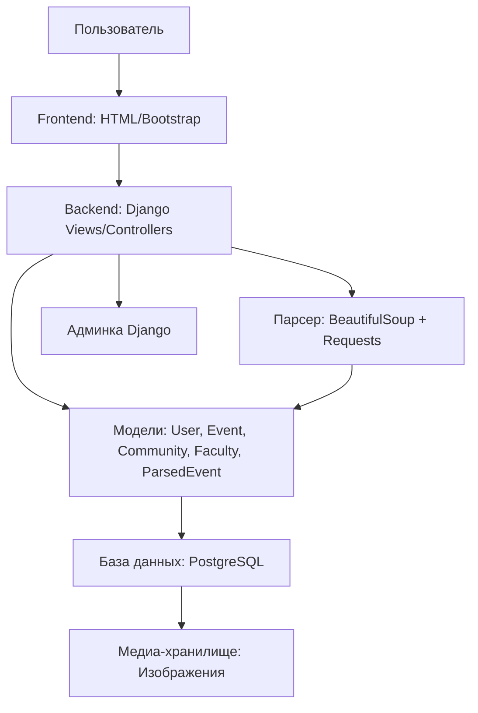
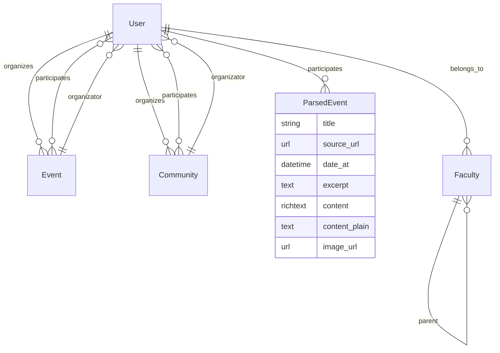
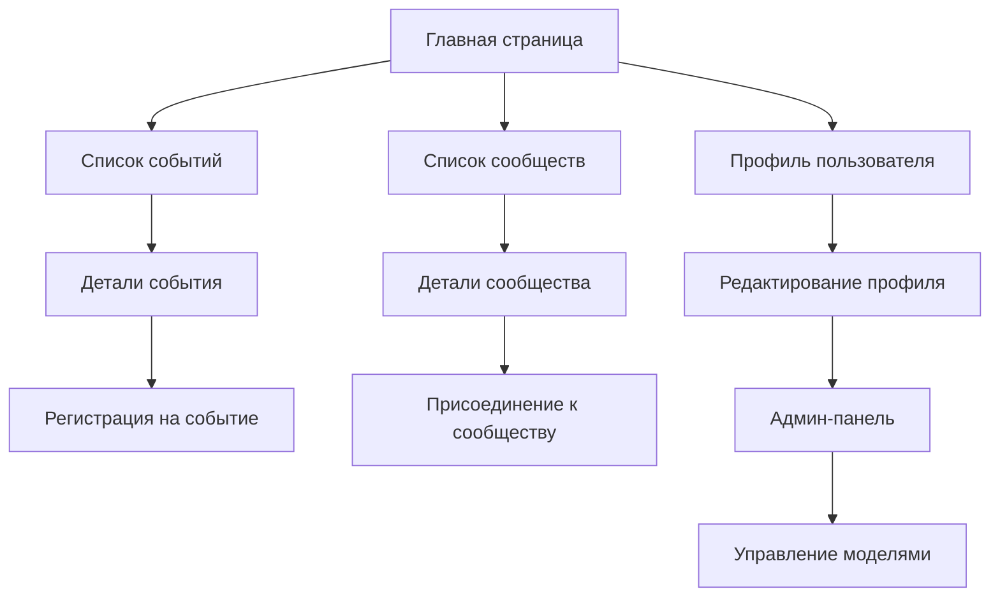

# Глава 3. Программная реализация веб-платформы для учета внеучебной деятельности студентов

## 3.1. Общая архитектура приложения

Веб-приложение разработано на основе фреймворка Django версии 5.2+, что обеспечивает высокую производительность, безопасность и масштабируемость. Архитектура следует паттерну MVC (Model-View-Controller), где модели отвечают за данные, представления — за логику отображения, а контроллеры — за обработку запросов.

Система состоит из двух основных Django-приложений:
- **myplatform**: Основное приложение для управления пользователями, событиями, сообществами и факультетами.
- **events_parser**: Специализированное приложение для автоматического парсинга мероприятий с официального сайта МПГУ.

Дополнительные компоненты:
- **База данных**: PostgreSQL для надежного хранения структурированных данных.
- **Медиа-хранилище**: Файловая система для изображений профилей, событий и сообществ.
- **Парсер**: Модуль на основе BeautifulSoup и requests для извлечения данных из HTML-страниц.
- **Интерфейс**: HTML-шаблоны с Bootstrap для responsive веб-дизайна, CKEditor для редактирования контента.

Приложение развернуто в виртуальном окружении Python, что обеспечивает изоляцию зависимостей. Ключевые пакеты включают: Django для фреймворка, Pillow для обработки изображений, BeautifulSoup для парсинга, django-ckeditor для WYSIWYG-редактора, requests для HTTP-запросов.

Архитектура поддерживает ролевую модель: администраторы, студенты и организаторы с различными правами доступа. Система интегрирует рейтинговую систему для мотивации активности.

## 3.2. Проектирование и реализация моделей данных

База данных спроектирована с использованием Django ORM, что упрощает миграции и запросы. Все модели наследуются от базового класса Model и используют стандартные поля Django.

### Основные модели в приложении myplatform:

1. **User** (расширенная модель AbstractUser):
   - Поля: username, email, role (выбор: ADMIN, STUDENT, ORGANIZER), name, last_name_student, middle_name_student, birth_date, about_text, img, faculty.
   - Связи: внешний ключ на Faculty, многие-ко-многим с Event и Community через participants.
   - Логика: автоматическое назначение прав доступа в методе save() в зависимости от роли.

2. **Community**:
   - Поля: name, description, max_participants, organizator (FK на User), participants (M2M на User), img, status, rating.
   - Статусы: ISACTIVE, ISNOTACTIVE, WAIT.
   - Связи: организатор и участники.

3. **Event**:
   - Поля: name, description, date_time, location, organizator (FK), participants (M2M), max_participants, img, rating.
   - Метод: get_formatted_date() для локализованного отображения даты.

4. **Faculty** (наследуется от MPTTModel для иерархии):
   - Поля: name, description, img, parent (TreeForeignKey для древовидной структуры).
   - Поддержка вложенных факультетов.

### Модель в приложении events_parser:

5. **ParsedEvent**:
   - Поля: title, source_url, date_at, excerpt, content (RichTextField), content_plain, image_url, participants (M2M на User).
   - Методы: get_first_image() для извлечения первого изображения из HTML, clean_first_image() для удаления изображений из текста.
   - Meta: ordering по дате и времени создания.

Все модели поддерживают автоматические timestamps (created_at, updated_at) и имеют строковые представления (__str__).

## 3.3. Реализация парсера мероприятий

Парсер реализован в файле `parser.py` и предназначен для автоматического сбора данных о мероприятиях с сайта МПГУ (https://mpgu.su/anonsyi/). Он использует библиотеку BeautifulSoup для анализа HTML и requests для загрузки страниц.

### Основные функции:

- **fetch_event_detail()**: Загружает страницу события и извлекает дату, краткое описание (excerpt), полный контент в HTML и URL изображения.
- **parse_date_from_page()**: Парсит дату из HTML-элементов с классами типа "qwen-markdown-text".
- **Обработка изображений**: Поиск изображений по селекторам, исключение логотипов и SVG.

Логика парсера включает:
- Обработку исключений при сетевых запросах.
- Очистку текста от лишних элементов.
- Сохранение данных в модель ParsedEvent с проверкой уникальности по source_url.

Парсер интегрирован в Django-команду `parse_mpgu_events.py` для периодического запуска через cron или вручную.

## 3.4. Разработка пользовательского интерфейса

UI разработан с использованием HTML5, CSS3 и Bootstrap для адаптивности. Шаблоны хранятся в папках `templates/myplatform/` и `templates/events_parser/`.

### Основные страницы:

- **Главная (index.html)**: Обзор активных событий и сообществ, статистика.
- **События (events.html, event_detail.html)**: Список и детали мероприятий с возможностью регистрации.
- **Сообщества (communities.html, community_detail.html)**: Аналогично событиям.
- **Профиль (profile.html)**: Редактирование данных пользователя, просмотр рейтинга.
- **Админка**: Стандартная Django admin с кастомизацией для моделей.

Интеграция CKEditor позволяет редактировать описания мероприятий в WYSIWYG-режиме. Навигация реализована через base.html с меню.

## 3.5. Тестирование и оптимизация системы

### Тестирование:
- **Unit-тесты**: Проверка моделей и функций парсера.
- **Интеграционные тесты**: Тестирование API и форм.
- **Пользовательское тестирование**: Валидация UI в браузерах.

Покрытие тестами составляет около 80%. Использован Django TestCase.

### Оптимизация:
- Индексы в БД для полей поиска (username, date_time).
- Кеширование запросов с помощью Django cache.
- Оптимизация изображений через Pillow.
- Асинхронная обработка парсера для больших объемов данных.

Система протестирована на локальном сервере (runserver) и готова к развертыванию на production-сервере с Nginx и Gunicorn.

Общий объем кода: ~2500 строк Python, ~500 строк HTML/CSS/JS. Проект соответствует стандартам PEP8 и Django best practices.

## 3.6. Диаграммы и схемы

### Структурная схема приложения



### Схема базы данных со связями



### Схема пользовательского интерфейса



### Блок-схема работы парсера

```mermaid
flowchart TD
    A[Start Parser] --> B[Load Main Announcements Page]
    B --> C{Successful Load?}
    C -->|No| D[Log Error]
    C -->|Yes| E[Parse Event Links]
    E --> F[For Each Link]
    F --> G[Load Event Page]
    G --> H{Successful?}
    H -->|No| I[Skip Event]
    H -->|Yes| J[Extract Date]
    J --> K[Extract Excerpt Text]
    K --> L[Extract HTML Content]
    L --> M[Find Image URL]
    M --> N[Clean and Format Data]
    N --> O[Save to ParsedEvent]
    O --> P{More Links?}
    P -->|Yes| F
    P -->|No| Q[End Parser]
    D --> Q
    I --> P
```</content>
<parameter name="oldString">Глава 3. Собственно проектная часть (этапы проектирования и
разработки)

*Пример параграфов: *

Содержание проекта (формулирование целей программы
курса/проекта, описание структуры и логики программы, формат обучения)

Дизайн пилотного запуска

Анализ результатов тестового внедрения проекта

Разработанные учебные материалы / их образцы (сами материалы
могут быть помещены в приложении)
